<!-- ═══════════════════════════ HEADER ═══════════════════════════ -->

 

<!-- ═══════════════════════════ WHO I AM ═══════════════════════════ -->

## ⚡ Who I Am

<!-- ═══════════════════════════ AI WORKFLOW ═══════════════════════════ -->

## 🤖 How I Ship — My AI-Native Pipeline

*Most engineers write code. I operate a system.*

**Claude** architects → **Notion** captures the spec → **Linear** tracks the sprint → **Claude Design** shapes the UI → **Claude Code** builds it → **GitHub PRs** keep it clean → **Vercel** puts it in production. Then the loop feeds back and it all gets sharper.

 

<!-- ═══════════════════════════ TECH STACK ═══════════════════════════ -->

## 🛠️ Arsenal

<table>
<tr>
<td align="center" width="45%">

</td>
<td width="55%">
<table width="100%">
<tr><th align="left">🎯 Frontend</th><td>React · Next.js · Redux · React Native · Gatsby</td></tr>
<tr><th align="left">⚙️ Backend</th><td>Node.js · Express · Python · REST · MongoDB · MySQL</td></tr>
<tr><th align="left">☁️ Cloud &amp; Infra</th><td>AWS · Firebase · Vercel · CI/CD · GitHub Actions</td></tr>
<tr><th align="left">🤖 AI Tooling</th><td>Claude · Claude Code · Linear · Notion MCP</td></tr>
</table>
</td>
</tr>
</table>

 

<!-- ═══════════════════════════ SNAKE ═══════════════════════════
  ⚠️ UNCOMMENT THIS BLOCK ONLY AFTER the snake GitHub Action has run
  successfully at least once (Actions tab → "Generate Snake Animation"
  → Run workflow → wait for the green check → confirm the `output`
  branch exists). Until then it renders as a broken image.

═══════════════════════════════════════════════════════════════ -->

<!-- ═══════════════════════════ CONNECT ═══════════════════════════ -->

## 🤝 Let's Build Something

**Open to founding-engineer roles, technical partnerships, and ambitious products.**

&nbsp;
&nbsp;

 

